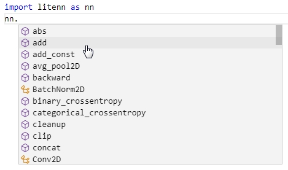
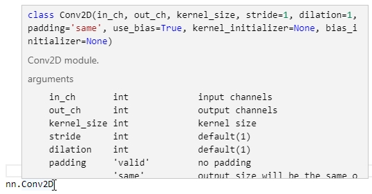

<table align="center" border="0">

<tr><td colspan=2 align="center">

# User guide.

## Learn quickly with snippets
</td></tr>

<tr><td colspan=2 align="center">

```python
# all user need is
```
```python
import litenn as nn
```
</td></tr>
<tr><td colspan=2 align="center">


```python
# Use IDE hint to discover available methods and classes
```


</img>

```python
# and read item documentation
```

</img>


</td></tr>
<tr><td colspan=2 align="left">

```python
# Simple Tensor constructor with only 2 arguments
nn.Tensor(shape, init=None)

# no scalar shape, the smallest shape is (1,)
# no dtype specifier, all tensors are float32 for users
# no trainable specifier
# no requires_grad specifier
```
---
```python
t = nn.Tensor ( (2,)  )
# get data of Tensor as numpy array
t.np() # [0. 0.]
```
---
>```python
>Initialize the Tensor
>```

```python
# using initializer in nn.initializer.* namespace
t = nn.Tensor ( (2,3), init=nn.initializer.RandomUniform(-1.0, 1.0) )
t.np() # [[ 0.22561646 -0.7469095  -0.99798244]
       #  [-0.8677587   0.2515936  -0.5231918 ]]
```
```python
# using your own numpy value
n = np.ones( (1,4) )
t = nn.Tensor_from_value(n)
t.np() # [[1., 1., 1., 1.]]
```
```python
# operators - start with lowercase letter in nn.* namespace
```
```python
x = nn.Tensor ( (2,), init=nn.initializer.RandomUniform(-10.0, 10.0) )
x.np() # [-5.7435327  -0.74709654]

x = nn.tanh(x)
x.np() # [-0.9999795 -0.6334136]
```


```python
# operate tensors using python operators
```
```python
a = nn.Tensor ( (1,), init=nn.initializer.Scalar(1.0) )
b = nn.Tensor ( (1,), init=nn.initializer.Scalar(2.0) )
(a+b).np() # [3.]
(a*b).np() # [2.]
(a/b).np() # [0.5]
```
```python
# some operators exist directly in Tensor's namespace
```
```python
a = nn.Tensor ( (5,), init=nn.initializer.Scalar(1.0) )
a.sum() # [5.]
a.mean() # [1.]
```
```python
# Modules - start with Uppercase letter in nn.* namespace
# Module contains saveable/trainable Tensors, other Modules,
# and operates on input tensor by calling the Module
```
```python
# Dense is standard fully-connected layer.
dense = nn.Dense(4,8)

# input shape is (batch_size,channels)
x = nn.Tensor ( (1,4) ) 
x = dense(x)

x.shape # (1,8)
```
```python
# Image shape is NCHW
# batch size, channels, height, weight
```
```python
# Convolve the image
conv1 = nn.Conv2D(3, 8, kernel_size=5)
x = nn.Tensor ( (1,3,64,64) )
x = conv1(x)

x.shape # (1,8,64,64)
```
```python
# Combine multiple layers into one
```
```python
class Encoder(nn.Module):
    def __init__(self, resolution):
        self.convs = [ nn.Conv2D(3,8,5, stride=2),
                       nn.Conv2D(8,16,5, stride=2) ]

        flatten_size = 16 * ( resolution / 2**len(self.convs) ) ** 2
        self.dense1 = nn.Dense(flatten_size, 16)


    def forward(self, x):
        for conv in self.convs:
            x = conv(x)
        x = nn.flatten(x)
        x = self.dense1(x)
        return x

resolution = 64

encoder = Encoder(resolution)

input_t = nn.Tensor ( (1,3,resolution,resolution) )
code_t = encoder (input_t)

code_t.shape # (1, 16)
```
```python
# Optimizers in nn.optimizer.* namespace

opt = nn.optimizer.Adam(..., lr=2e-4)
```
```python
# Train the Module
```
```python
class MLP(nn.Module):
    def __init__(self):
        self.dense1 = nn.Dense(1, 8)
        self.dense2 = nn.Dense(8, 1)

    def forward(self, x):
        x = self.dense1(x)
        x = self.dense2(x)
        return x

mlp = MLP()

# get trainable tensors from the Module
trainables = mlp.trainables()

opt = nn.optimizer.Adam(trainables, lr=2e-4)

# zero gradient of trainable tensors
opt.zero_grad()

input_t  = nn.Tensor( (4, 1), init=nn.initializer.Scalar(1.0) )
target_t = nn.Tensor( (4, 1), init=nn.initializer.Scalar(2.0) )

result_t = mlp(input_t)

mse_loss = nn.square(result_t-target_t).mean()
mse_loss.backward()

opt.step()
```
```python
# Exploring the gradients
```
```python
input_t  = nn.Tensor( (4, 1), init=nn.initializer.Scalar(1.0) )
target_t = nn.Tensor( (4, 1), init=nn.initializer.Scalar(2.0) )

mse_loss = nn.square(input_t-target_t).mean()
mse_loss.backward()

input_t.has_grad() # False
# input_t has NO grad, because it is not attached to any Optimizer.
# backward() automatically frees memory of unused gradients

# specify grad_for_non_trainables=True to keep all gradients
mse_loss.backward(grad_for_non_trainables=True)
input_t.has_grad() # True
```
```python
# backward from multiple tensors of any shape
```
```python
nn.backward([loss1, loss2])
```
```python
# Save/Load Modules
```
```python
class MLP(nn.Module):
    def __init__(self):
        self.dense1 = nn.Dense(1, 8)
        self.dense2 = nn.Dense(1, 8)
        self.dense3 = nn.Dense(8, 1)

    def forward(self, x):
        x = self.dense1(x) + self.dense2(x)
        x = self.dense3(x)
        return x

mlp = MLP()
mlp.save('mlp.npy')
mlp.load('mlp.npy')

# Save only particular module
mlp.dense1.save('mlp_dense1.npy')

# You can operate saveable data manually
dense1_state = mlp.dense1.dump_state()

# try to load dense2 from dense1 state
mlp.dense3.load_state(dense1_state)

# You will get a warnings:
"""
Tensor .weight is not loaded, because
saved Tensor shape is (1, 8), but must be (8, 1)
"""

mlp.dense2.load_state(dense1_state)
# Fine, because internal saveable data of .dense1 match .dense2
```
```python
# Combine all things into one module
```
```python
class MLP(nn.Module):
    def __init__(self):
        self.dense1 = nn.Dense(1, 8)
        self.dense2 = nn.Dense(1, 8)
        self.dense3 = nn.Dense(8, 1)

    def forward(self, x):
        x = self.dense1(x) + self.dense2(x)
        x = self.dense3(x)
        return x

class Networks(nn.Module):

    def __init__(self):
        self.mlp1 = MLP()
        self.mlp2 = MLP()

        trainables = self.mlp1.trainables() + \
                     self.mlp2.trainables()

        self.opt = nn.optimizer.Adam(trainables)
        
    def train_one_iter(self, input_t):
        self.opt.zero_grad()

        x = input_t
        x = self.mlp1(x)
        x = self.mlp2(x)

        loss = x.mean()
        loss.backward()

        self.opt.step()

networks = Networks()

for _ in range(10):
    input_t = nn.Tensor( (4,1), init=nn.initializer.Scalar(1.0) )

    networks.train_one_iter(input_t)

networks.save('networks.npy')
```
```python
# ! You cannot instantiate the Module from file without definition

# ! .load() works only with already instantiated Modules

# ! .load() loads the data only to the existing variables
```
```python
```
```python
# Devices
```
```python
# Get all devices
all_devices = nn.devices.get_all()

# Set all devices as current devices
nn.devices.set_current( nn.devices.get_all() )

# Set only best device as current device
nn.devices.set_current( nn.devices.get_best() )

# Ask user to choose devices and set them as current
nn.devices.set_current( nn.devices.ask_to_choose() )

```
```python
# MultiGPU
```
```python
# Tensor works on MultiGPU by default, if multiple devices set as current.
```
```python
nn.devices.set_current( nn.devices.get_all()[0:2] )
value_n = np.array ([40, 50])

# slice first dimension to all devices
x = nn.Tensor_sliced_from_value (value_n)

# get value from specific device
x.np(0) # [40.]
x.np(1) # [50.]

y = x * 2
y.np(0) # [80.]
y.np(1) # [100.]
```
```python
# MultiGPU training
```
```python
opt = nn.optimizer.Adam(...)

# do MultiGPU step on optimizer every N iteration
if iter % 16 == 0:
    opt.step(multi_gpu_step=True)
    
# multi_gpu_step averages trainable tensors on multiple gpus.
# Should not be used every iteration
```


</td></tr>


</table>
